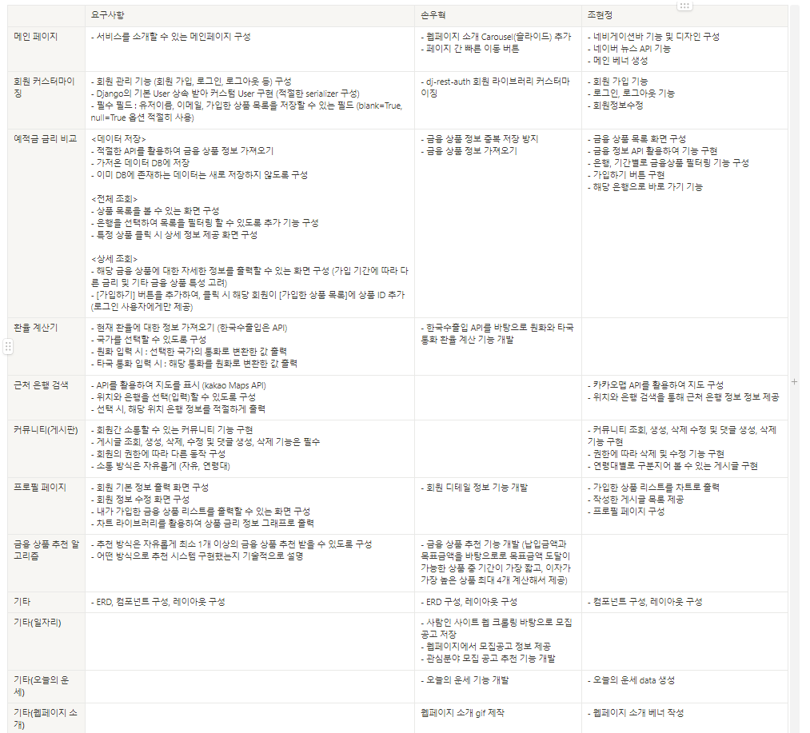
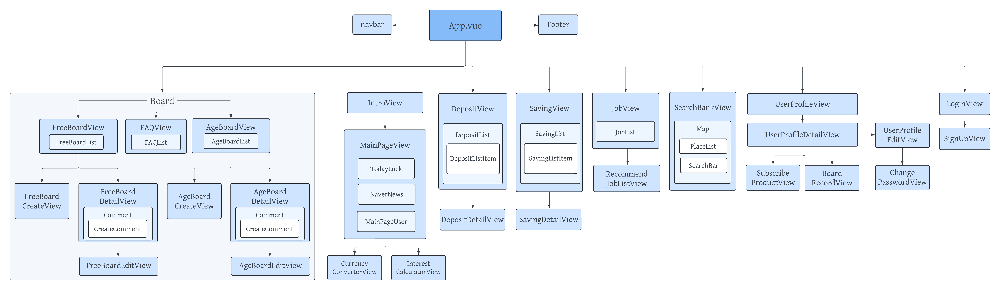

# FINe JOB

## 프로젝트 이름 : FINe JOB
### 팀원 : 부울경 2반 손우혁🧑, 부울경 2반 조현정👩 

#### 프로젝트 기간 : 2024.05.09-2024.05.23 (15일)

### 기술 스택 

## 업무 분단 내역

## 설계 내용 (아키텍처 등) 실제 구현 정도
### 컴포넌트 구조

### 실제 구현 정도
| NO | 구분 | 기능 | 구현정도(⭐⭐⭐⭐⭐ ) |
| --- | --- | --- | --- |
| 1 | 인트로 | 웹페이지 소개 화면 구성 | ⭐⭐⭐⭐⭐     |
| 2 | 메인페이지 | 메인페이지 레이아웃 및 디자인 CSS | ⭐⭐⭐⭐⭐     |
| 3 |  | 최신 경제 뉴스 제공 | ⭐⭐⭐⭐⭐     |
| 4 |  | 오늘의 운세 | ⭐⭐⭐⭐ (신빙성은 없음)  |
| 5 |  | 웹 서비스 소개 Carousel 기능 구현 | ⭐⭐⭐⭐⭐     |
| 6 |  | 웹 페이지 캐릭터 "핀이(FINe)" 제작 | ⭐⭐⭐⭐⭐      |
| 7 | 회원 커스터마이징 | 회원 가입 및 로그인/ 로그아웃 기능 및 화면 구현 | ⭐⭐⭐⭐⭐     |
| 8 |  | 프로필 이미지 설정 | ⭐⭐⭐⭐ (사용자 직접 못함. 사용자 정보 바탕으로 랜덤 배정)     |
| 9 |  | 회원/ 비회원에 따라 권한 설정 | ⭐⭐⭐⭐ (일부 페이지에서만 가드 적용)     |
| 10 | 예/적금 금리 비교 | 이자계산기 기능 구현 | ⭐⭐⭐⭐⭐     |
| 11 |  | 입력 받은 정보를 기반으로 상품 추천 알고리즘 | ⭐⭐⭐⭐⭐     |
| 12 |  | API 활용해 금융 상품 DB 저장 | ⭐⭐⭐⭐⭐     |
| 13 |  | 관심상품 등록 기능 및 조회 | ⭐⭐⭐⭐⭐     |
| 14 |  | 상품 상세 정보 화면 구현 | ⭐⭐⭐⭐⭐      |
| 15 |  | 카테고리별 검색 기능 | ⭐⭐⭐⭐⭐     |
| 16 | 금융계산기 | 이자계산기 구현 | ⭐⭐⭐⭐⭐     |
| 17 |  | API를 활용한 환율 정보 DB 저장  | ⭐⭐⭐⭐⭐     |
| 18 |  | axios 활용하여 환율 정보 가공 및 화면 구현 | ⭐⭐⭐⭐⭐     |
| 19 |  | 화폐 선택 시 국기 이미지 표시 | ⭐⭐⭐⭐⭐     |
| 20 |  | 오늘의 환율 정보 제공 | ⭐⭐⭐⭐⭐     |
| 21 | 근처 은행 지도 | API를 활용하여 Kakao 맵 화면 구현   | ⭐⭐⭐⭐⭐  |
| 22 |  | 키워드에 맞는 검색 결과 구현 | ⭐⭐⭐⭐⭐     |
| 23 |  | 카카오 맵 마커에 장소 정보 표시 및 해당 장소 링크로 이동  | ⭐⭐⭐⭐⭐ |
| 24 |  | 카카오 맵 장소 목록 클릭시 해당 은행으로 이동  | ⭐⭐⭐⭐⭐ |
| 25 | 커뮤니티 | 게시글 및 댓글 CRUD 기능 구현 | ⭐⭐⭐⭐⭐     |
| 26 |  | 게시글 검색 기능 구현  | ⭐⭐⭐⭐⭐     |
| 27 |  | 게시글을 카테고리에 따라 작성자 표시를 다르게 구현 | ⭐⭐⭐⭐⭐     |
| 28 | 유저 프로필 | 회원 정보 수정, 비밀번호 변경 기능 | ⭐⭐⭐⭐⭐     |
| 29 |  | 회원 탈퇴 기능 | ⭐⭐⭐⭐⭐     |
| 30 |  | 본인이 작성한 게시글 조회 | ⭐⭐⭐⭐⭐     |
| 31 |  | 관심상품 등록한 예/적금 상품 조회 | ⭐⭐⭐⭐⭐     |
| 32 |  | 차트 라이브러리 통해 금리 비교  | ⭐⭐⭐⭐⭐    |
| 33 | 웹 페이지 하단 | 깃허브 이동 링크 추가 | ⭐⭐⭐⭐⭐    |
| 33 | 일자리 | 현재 채용 중인 일자리 목록 제공 | ⭐⭐⭐⭐⭐    |
| 33 |  | 관심 산업군에 따른 일자리 추천 | ⭐⭐⭐⭐⭐    |

## 데이터베이스 모델링 (ERD)

## 금융 상품 추천 알고리즘에 대한 기술적 설명
사용자로부터 원하는 납임금액과 목표금액을 입력 받아 해당 목표금액을 달성가능한 조건의 금융상품 제공
- 도달 가능한 상품이 여러개일 경우 
  - 우선순위 1. 기간이 가장 짧은 경우
  - 우선순위 2. 이자가 가장 높은 상품
  - 우선순위에따른 상품 최대 4개 계산해서 제공

## 프로젝트 느낀점, 후기
- 조현정

  처음 진행했던 프로젝트라 시작하기 전에는 어떻게 진행해야 할지, 어떤 방식으로 개발해야 하는지 감이 잡히지 않았습니다. 프로젝트는 지난 5개월 동안 배운 내용을 토대로 진행되었기 때문에, 배운 내용을 정리하고 활용해볼 수 있는 소중한 시간이었습니다. 특히, 프론트엔드와 백엔드 각각에서 하던 작업들을 연결하는 과정을 통해 개발의 전반적인 흐름을 더 잘 이해할 수 있었습니다.

  구현 전에 컴포넌트와 ERD를 설계했지만, 막상 개발을 진행하다 보니 설계한 것과 실제 개발에서는 차이가 많이 생김을 몸소 배울 수 있었습니다. 중간에 구현 과정에서 수많은 에러를 만나면서 힘든 순간도 많았지만, 그 에러를 해결하고 하나하나 진행해 나가는 과정에서 큰 뿌듯함을 느낄 수 있었습니다. 최종 관통 프로젝트를 통해 처음부터 끝까지 직접 만들어보는 경험을 하면서 많은 성장을 이뤘습니다.

  마지막으로, 처음 프로젝트를 함께 했던 페어 우혁이에게 감사의 인사를 전하고 싶습니다. 좋은 페어가 있었기에 프로젝트를 잘 마무리할 수 있었다고 생각합니다.

- 손우혁

  SSAFY에서 처음 진행한 팀 프로젝트이며, 5개월 동안의 학습을 토대로 총 10일간 진행한 프로젝트였습니다. 약 일주일의 시간 동안 지금까지 배웠던 기술들을 한 번씩 활용해볼 수 있는 의미 있는 기회였습니다.
  나만의 웹페이지를 만들면서 더욱 잘 만들고 싶다는 욕심이 나서 더 몰입하게 되었습니다. 아이디어 구상부터 개발까지 처음 설계했던 대로만 흘러가지 않아 어려움도 있었지만, 팀원과의 회의를 통해 기능도 이것저것 추가해보며 시간 가는 줄 모르고 프로젝트를 진행했었습니다. 
  특히 웹페이지 소개 페이지를 만들 때 가장 뿌듯했습니다. 마지막으로 프로젝트 기간 함께 노력해 좋은 결과를 낼 수 있도록 해준 현정이 누나에게 고생 많았고 고맙다는 말을 전하고 싶습니다.