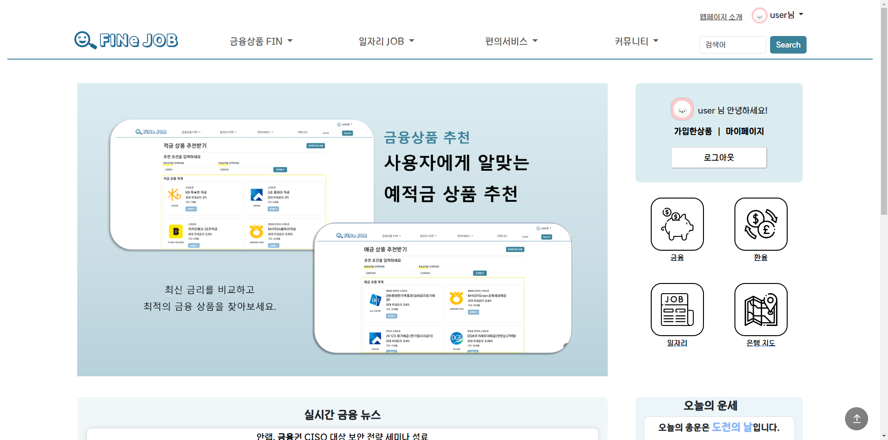
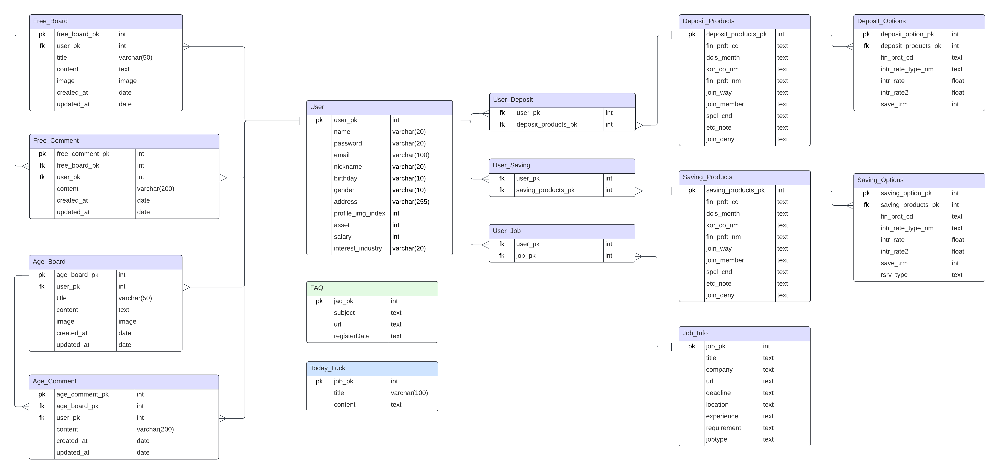

# final-pjt : FINe JOB 🔍

### 👥 팀원 : 부울경 2반 손우혁🧑, 부울경 2반 조현정👩 

#### 🗓️ 프로젝트 기간 : 2024.05.09-2024.05.23 (15일)
 

## 💻 기술 스택 

 

## 📰 업무 분단 내역

 

## 설계 내용 (아키텍처 등) 실제 구현 정도
### 🗂️ 컴포넌트 구조

 

## 일정 
- 5/9 회의 및 개발
  - 프로젝트 주제 선정
  - 서비스 의도 및 대상 설정
  - 필요한 API 검색 및 정리
  - 웹사이트 구성 페이지 정리
  - 웹사이트 기능별 정리
  - 데이터베이스 모델 정리
  - 추천 알고리즘 초안
  - git repository 생성

- 5/10 회의 및 개발
  - 기술스택 작성
  - 주말동안 진행할 업무 분배
  - 프로젝트 이름 설정
- 5/11 회의 및 개발
  - ERD 초안 생성
  - 레이아웃 구성

- 5/13 회의 및 개발
  - django 기본 뼈대 구조 설정 → 레포에 올리기
      - 분업 관리
          
          back : 계정-손우혁 / 게시판-조현정
          
          → settings 설정, models 데이터 모델링
        
  - 대표 컬러 정하기

- 5/14 회의 및 개발
  - ERD 마무리
  - 컴포넌트 추가 수정
  - 레이아웃 마무리
  - 로고 설정
  - back ⇒ api db 넣어보기

- 5/15 (수) 해올 것
    - api 기능 개발 : 우혁-일자리, 현정-네이버기사

- 5/15 회의 및 개발
  - 사람인 데이터 크롤링
  - 네이버뉴스 api 받아서 출력

- 5/16 회의 및 개발
  - 카카오맵 api 받아오기 및 화면 출력 확인하기
  - 환율 api 받아보기
  - 지도, 환율계산기 컴포넌트 및 레이아웃 구성
  - 회원가입 기능 확인
  - 게시판 crud 기능 확인
  - 회원정보 수정
  - 금융상품 api 확인

- 5/17 회의 및 개발
  - 예적금 기능 완성 (관심 상품 추가 기능)
  - 오늘의 운세 기능
  - 유저 관심 일자리 공고
  - 추천 알고리즘 완성 (단리, 복리에 따른)
  - vue 전체 components, views 생성
  - 카카오맵 기능 80% 구현
  - 유저디테일 정보 조회 구현
  - FAQ 기능 개발

- 5/18~5/19 회의 및 개발
  - 컴포넌트 수정
  - 게시글 목록, 상세페이지, 수정 컴포넌트 생성 + 댓글 작성 및 삭제 컴포넌트 생성
  - 네이버뉴스 컴포넌트 생성
  - 예적금 목록, 디테일 컴포넌트 생성
  - 환율계산기 컴포넌트 생성
  - 회원가입 기능 개발
  - 로그인, 로그아웃 기능
  - 오늘의 운세 기능

- 5/20 회의 및 개발
  - 예적금 관심상품 기능 구현
  - 게시글 작성자 출력
  - Token 전체 수정
  - 로그인 유지시키기
  - ERD 완성본
  - 메인 페이지 진행 시작
  - 일자리 컴포넌트 초안 완성
  - 소스코드 통합 (백, 프론트)

- 5/21 회의 및 개발
  - 프로필 페이지 완성
  - 근처 은행 찾기 (카카오맵) 완성
  - 오늘의 운세! 해쉬값으로 설정
  - 메인페이지 추천 공고 생성
  - FAQ 데이터 넣기 (반 정도 함)
  - 예적금 추천 알고리즘 적용 (완성도 50%)
  - 연령별게시판 연령 필터추가

- 5/22 회의 및 개발
  - App.vue의 네비게이션바 수정
  - 게시판 네이게이션바 수정
  - 지도 기능 및 디자인 완성
  - 맨위로 가기 버튼 생성
  - 메인페이지 레이아웃 구성 완료
  - 인트로 페이지 구상 및 생성
  - 금융상품 목록 화면 수정
  - 로고이미지 수정
  - 이자계산기 추가 및 수정
  - footer 최종 완성

- 5/23 회의 및 개발
  - 최종 레이아웃 완성
  - 최종 모델링, 컴포넌트 완성
  - 프로필 이미지 설정
  - 웹페이지 고도화
 

## 이슈 관리
1. 가입자 정보를 출력할 때, username이 나오지 않았음

    -> user가 아닌 user.username에 접근해야 했음

    -> serializer를 잘 확인 해야 함

2. 프론트에서 axios를 통해 서버에 변수를 전달하는 것
  
   -> url을 통해 넣었음
 

### 📌 실제 구현 정도
| NO | 구분 | 기능 | 구현정도(⭐⭐⭐⭐⭐ ) |
| --- | --- | --- | --- |
| 1 | 인트로 | 웹페이지 소개 화면 구성 | ⭐⭐⭐⭐⭐     |
| 2 | 메인페이지 | 메인페이지 레이아웃 및 디자인 CSS | ⭐⭐⭐⭐⭐     |
| 3 |  | 최신 경제 뉴스 제공 | ⭐⭐⭐⭐⭐     |
| 4 |  | 오늘의 운세 | ⭐⭐⭐⭐ (신빙성은 없음)  |
| 5 |  | 웹 서비스 소개 Carousel 기능 구현 | ⭐⭐⭐⭐⭐     |
| 6 |  | 웹 페이지 캐릭터 "핀이(FINe)" 제작 | ⭐⭐⭐⭐⭐      |
| 7 | 회원 커스터마이징 | 회원 가입 및 로그인/ 로그아웃 기능 및 화면 구현 | ⭐⭐⭐⭐⭐     |
| 8 |  | 프로필 이미지 설정 | ⭐⭐⭐⭐ (사용자 직접 못함. 사용자 정보 바탕으로 랜덤 배정)     |
| 9 |  | 회원/ 비회원에 따라 권한 설정 | ⭐⭐⭐⭐ (일부 페이지에서만 가드 적용)     |
| 10 | 예/적금 금리 비교 | 이자계산기 기능 구현 | ⭐⭐⭐⭐⭐     |
| 11 |  | 입력 받은 정보를 기반으로 상품 추천 알고리즘 | ⭐⭐⭐⭐⭐     |
| 12 |  | API 활용해 금융 상품 DB 저장 | ⭐⭐⭐⭐⭐     |
| 13 |  | 관심상품 등록 기능 및 조회 | ⭐⭐⭐⭐⭐     |
| 14 |  | 상품 상세 정보 화면 구현 | ⭐⭐⭐⭐⭐      |
| 15 |  | 카테고리별 검색 기능 | ⭐⭐⭐⭐⭐     |
| 16 | 금융계산기 | 이자계산기 구현 | ⭐⭐⭐⭐⭐     |
| 17 |  | API를 활용한 환율 정보 DB 저장  | ⭐⭐⭐⭐⭐     |
| 18 |  | axios 활용하여 환율 정보 가공 및 화면 구현 | ⭐⭐⭐⭐⭐     |
| 19 |  | 화폐 선택 시 국기 이미지 표시 | ⭐⭐⭐⭐⭐     |
| 20 |  | 오늘의 환율 정보 제공 | ⭐⭐⭐⭐⭐     |
| 21 | 근처 은행 지도 | API를 활용하여 Kakao 맵 화면 구현   | ⭐⭐⭐⭐⭐  |
| 22 |  | 키워드에 맞는 검색 결과 구현 | ⭐⭐⭐⭐⭐     |
| 23 |  | 카카오 맵 마커에 장소 정보 표시 및 해당 장소 링크로 이동  | ⭐⭐⭐⭐⭐ |
| 24 |  | 카카오 맵 장소 목록 클릭시 해당 은행으로 이동  | ⭐⭐⭐⭐⭐ |
| 25 | 커뮤니티 | 게시글 및 댓글 CRUD 기능 구현 | ⭐⭐⭐⭐⭐     |
| 26 |  | 게시글 검색 기능 구현  | ⭐⭐⭐⭐⭐     |
| 27 |  | 게시글을 카테고리에 따라 작성자 표시를 다르게 구현 | ⭐⭐⭐⭐⭐     |
| 28 | 유저 프로필 | 회원 정보 수정, 비밀번호 변경 기능 | ⭐⭐⭐⭐⭐     |
| 29 |  | 회원 탈퇴 기능 | ⭐⭐⭐⭐⭐     |
| 30 |  | 본인이 작성한 게시글 조회 | ⭐⭐⭐⭐⭐     |
| 31 |  | 관심상품 등록한 예/적금 상품 조회 | ⭐⭐⭐⭐⭐     |
| 32 |  | 차트 라이브러리 통해 금리 비교  | ⭐⭐⭐⭐⭐    |
| 33 | 웹 페이지 하단 | 깃허브 이동 링크 추가 | ⭐⭐⭐⭐⭐    |
| 34 | 일자리 | 현재 채용 중인 일자리 목록 제공 | ⭐⭐⭐⭐⭐    |
| 35 |  | 관심 산업군에 따른 일자리 추천 | ⭐⭐⭐⭐⭐    |
 

## 📜 데이터베이스 모델링 (ERD)

 

## 💰 금융 상품 추천 알고리즘에 대한 기술적 설명
사용자로부터 원하는 납임금액과 목표금액을 입력 받아 해당 목표금액을 달성가능한 조건의 금융상품 제공
- 도달 가능한 상품이 여러개일 경우 
  - 우선순위 1. 기간이 가장 짧은 경우
  - 우선순위 2. 이자가 가장 높은 상품
  - 우선순위에 따른 상품 최대 4개 제공
 

## 👏 프로젝트 느낀점, 후기
- 조현정

  처음 진행했던 프로젝트라 시작하기 전에는 어떻게 진행해야 할지, 어떤 방식으로 개발해야 하는지 감이 잡히지 않았습니다. 구현 전에 컴포넌트와 ERD를 설계했지만, 막상 개발을 진행하다 보니 설계한 것과 다르게 구성하고 개발해 나가면서 실제 개발과의 차이를 몸소 느낄 수 있었습니다. 구현 과정에서 수많은 에러를 만나면서 힘든 순간도 많았지만, 그 에러를 해결하고 하나하나 진행해 나가는 과정에서 큰 뿌듯함을 느낄 수 있었습니다. 최종 관통 프로젝트는 지난 5개월 동안 배운 내용을 토대로 진행되었기 때문에, 배운 내용을 정리하고 활용해볼 수 있는 시간이었습니다. 이번 프로젝트를 통해 처음부터 끝까지 직접 만들어보는 경험을 하면서 많은 성장을 이룬 것 같습니다.

  마지막으로, 저의 첫 프로젝트를 함께 해준 페어 우혁이에게 감사의 인사를 전하고 싶습니다. 좋은 페어가 있었기에 프로젝트를 잘 마무리할 수 있었습니다.

- 손우혁

  SSAFY에서 처음 진행한 팀 프로젝트이며, 5개월 동안의 학습을 토대로 총 10일간 진행한 프로젝트였습니다. 약 일주일의 시간 동안 지금까지 배웠던 기술들을 한 번씩 활용해볼 수 있는 의미 있는 기회였습니다.
  나만의 웹페이지를 만들면서 더욱 잘 만들고 싶다는 욕심이 나서 더 몰입하게 되었습니다. 아이디어 구상부터 개발까지 처음 설계했던 대로만 흘러가지 않아 어려움도 있었지만, 팀원과의 회의를 통해 기능도 이것저것 추가해보며 시간 가는 줄 모르고 프로젝트를 진행했었습니다. 
  특히 웹페이지 소개 페이지를 만들 때 가장 뿌듯했습니다. 마지막으로 프로젝트 기간 함께 노력해 좋은 결과를 낼 수 있도록 해준 현정이 누나에게 고생 많았고 고맙다는 말을 전하고 싶습니다.
